La aplicacion es una pagina web de una cafeteria ficticia llamada Sweet Tooth que se utiliza tanto como menu para mostrar los productos que se ofrecen, como tambien para realizar pedidos desde donde el usuario esté aclarando su direccion antes de realizarlo.

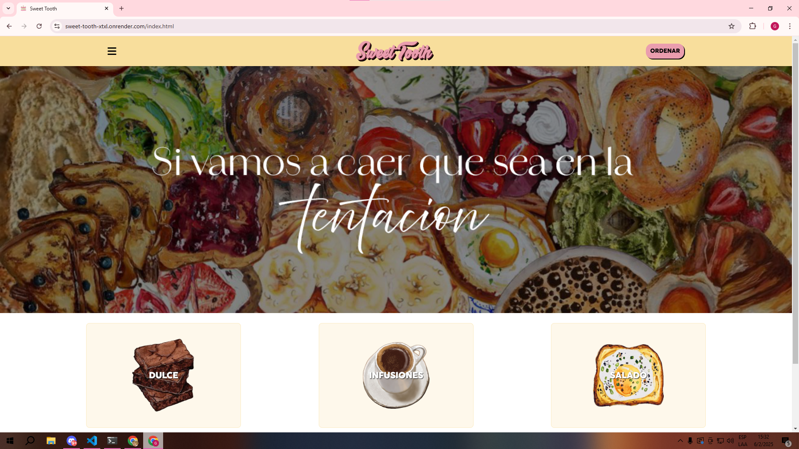
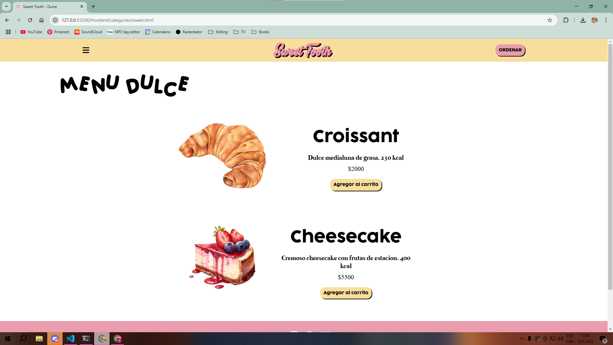
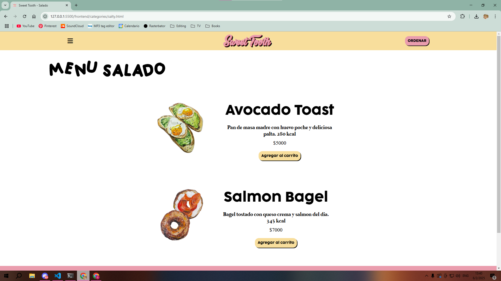
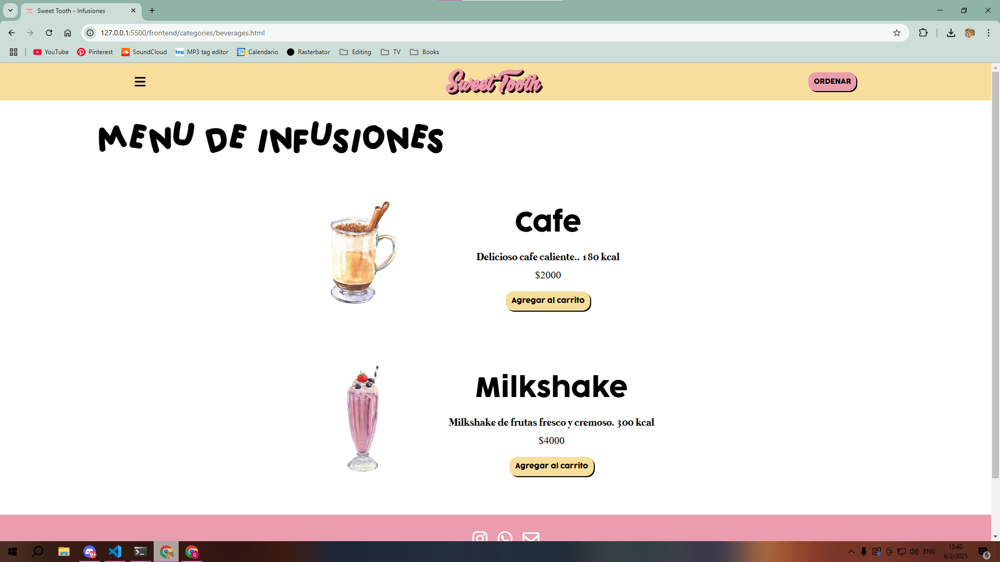

Para realizar un pedido como usuario o para ingresar como administrador primero se necesita registrarse. El boton para iniciar sesion o registrarse se encuentra en el menu de arriba a la izquierda señalado con el icono de 3 barras.


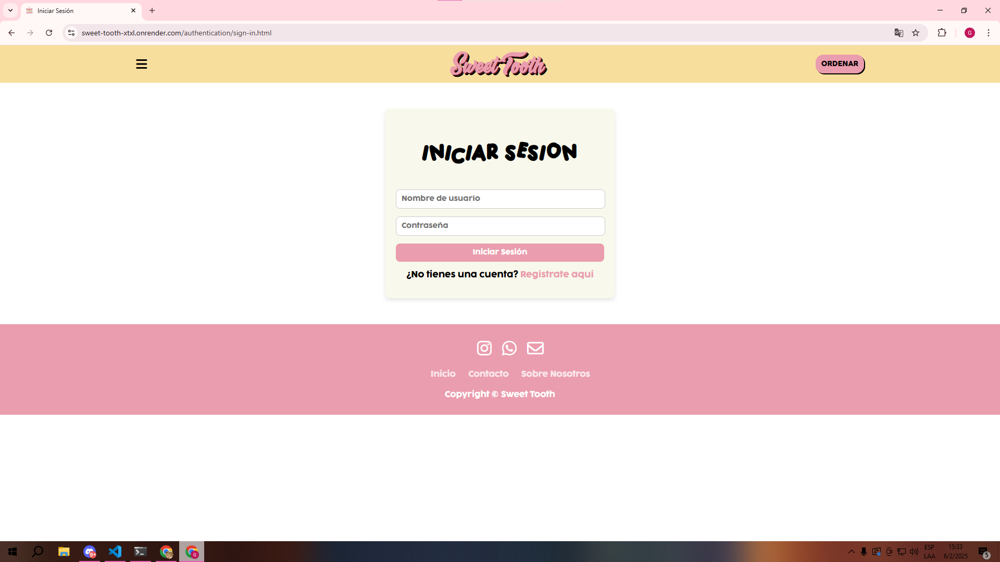
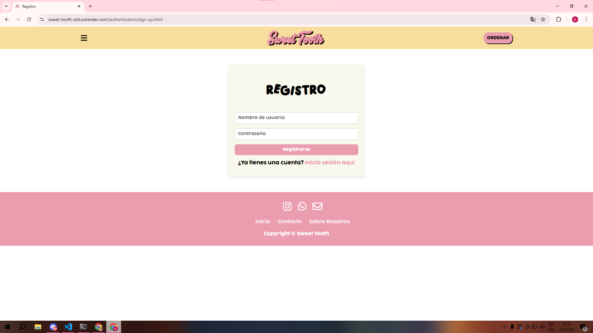

Al iniciar sesion como usuario tenes las opciones de: Carrito, Administrar direccion, Administrar ordenes y Cerrar sesion.

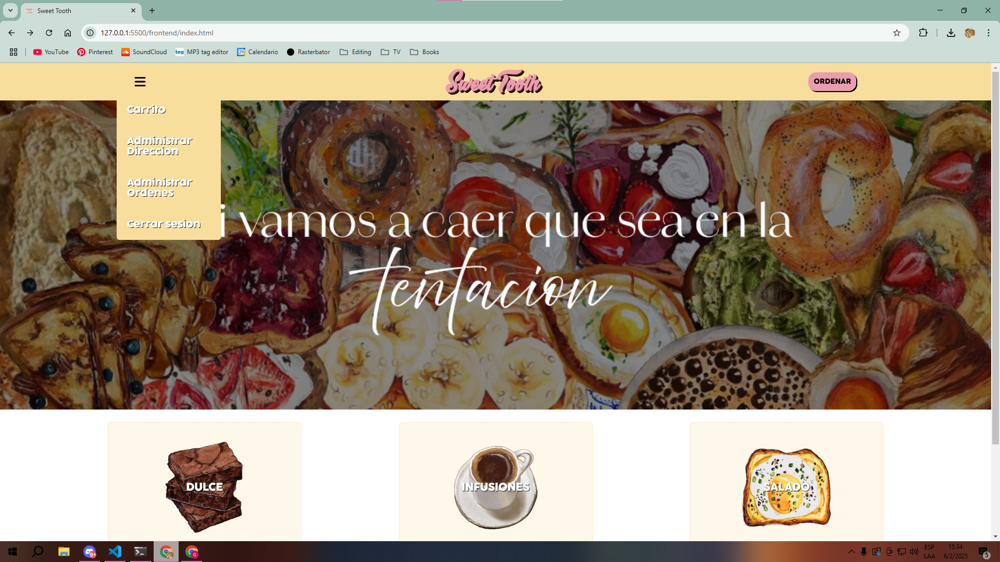

En Administrar direccion se ingresa la direccion en la cual queres recibir el pedido. Esto se debe completar ANTES de realizar el pedido.

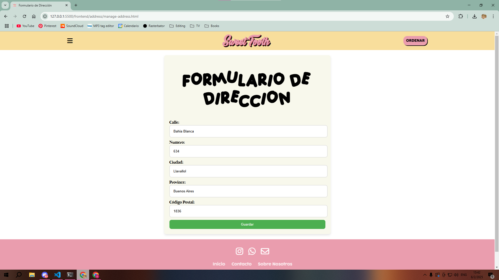

Para agregar productos al carrito se aprieta en el boton de "Agregar al carrito" que se encuentra debajo de los productos. Luego, para verlo, ingresamos a la parte de carrito en el menu de barras.

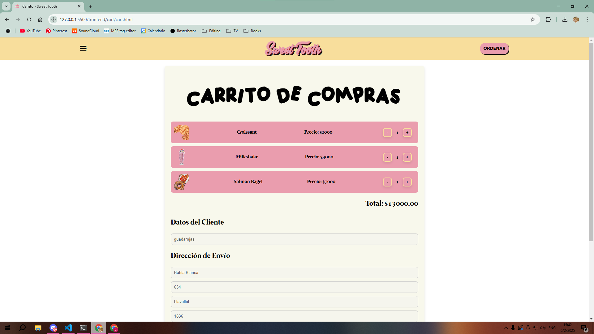

Cuando ya tengamos todos los productos deseados en el carrito apretamos el boton de "Realizar pedido" a lo ultimo de esta pagina. Luego, ya podremos ver nuestro pedido en la seccion de "Administrar ordenes" del menu de barras.

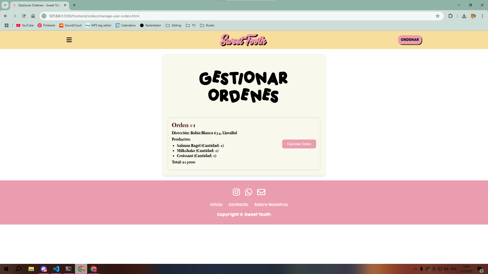

Al iniciar sesion como administrador las opciones cambian a: Carrito, Subir producto, Administrar productos, Administrar ordenes y Cerrar sesion.


En la seccion de "Subir producto" se necesita la informacion especificada del producto que se desea subir, la cual es: Nombre, Precio, Descripcion, Calorias, Tipo (DULCE, SALADO, INFUSION) y por ultimo una foto.

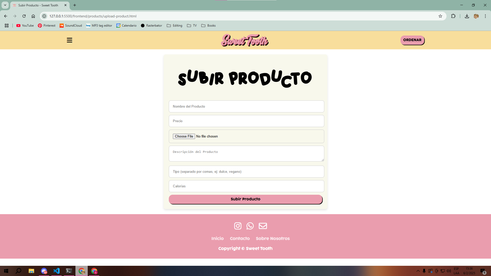

El carrito se mantiene igual. En "Administrar ordenes" se puede cambiar el estado del pedido realizado por el cliente para informarle como va su preparacion/envio. En "Administrar productos" se puede borrar y editar los productos que se desee.

## Como correr el proyecto

Para correrlo local: 

1. Ejecutar el backend.
```shell
npm start
```
2. Luego abrir el archivo index.html

Nota: Se debe configurar en un archivo .env la url a la base de datos de esta forma `DATABASE_URL={url base de datos}` y se debe configurar en el archivo `config.js` del frontend la url del backend (En este caso: `http://localhost:3000`)

Para correrlo con docker:

1. En la primer ejecucion ejecutar `docker-compose up --build` 
2. Una vez iniciado el servicio ejecutar: `docker-compose exec backend npx prisma migrate dev --name init` 
3. Ingresar en el navegador a `http://localhost:3000`

Nota: Se debe configurar en el archivo `config.js` del frontend la url del backend (En este caso: `http://localhost:3000`)

Para verlo en produccion puede ingresar a: `https://sweet-tooth-xtxl.onrender.com/`
